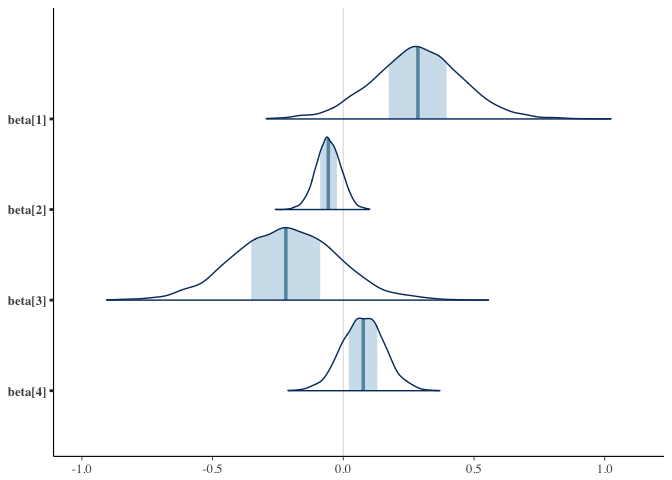
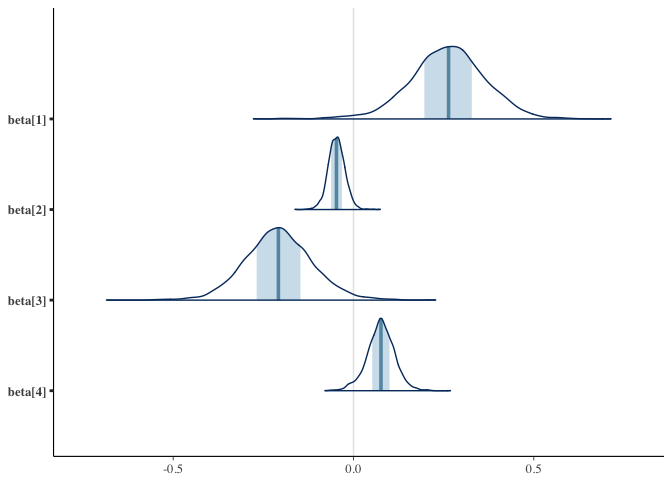
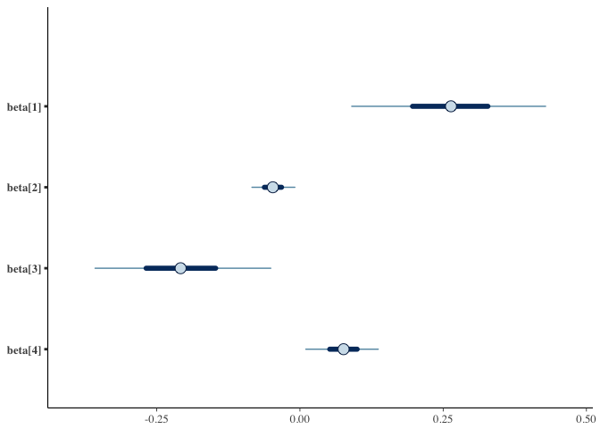

Stan models
================
2016-12-09

``` r
library(dplyr)
library(ggplot2)
```

Data
====

This loads a file containing posterior distributions for six Trophic Niche Metrics (TNM): dNr, dCr, TA, CD, MNND, and SDNND, from 16 different reef sites. Data file also contains three reef variables: LFTADen (Lionfish density /100m2), HASAve (averaged score of habitat complexity), and lionfish removal treatment (binary, yes/no).

``` r
d <- read.csv("data/FullCommNoLF.csv")
```

Quick model
===========

``` r
d_logged <- group_by(d, Site) %>%
  mutate_each(funs(log), dNr:SDNND)

d_means <- d_logged %>%
  summarise_each(funs(mean))

d_sds <- d_logged %>%
  summarise_each(funs(sd), dNr:SDNND) %>%
  dplyr::select(-Site)
names(d_sds) <- paste0(names(d_sds), "_sd")

d_sum <- data.frame(d_means, d_sds)
m1 <- lm(dNr ~ HASAve + LFTADen * RemovTreat, data = d_sum)
arm::display(m1)
#> lm(formula = dNr ~ HASAve + LFTADen * RemovTreat, data = d_sum)
#>                    coef.est coef.se
#> (Intercept)         0.81     0.20  
#> HASAve              0.26     0.09  
#> LFTADen            -0.05     0.02  
#> RemovTreat         -0.21     0.08  
#> LFTADen:RemovTreat  0.08     0.03  
#> ---
#> n = 16, k = 5
#> residual sd = 0.09, R-Squared = 0.60
```

Stan
====

Same model to check:

``` r
# d_sum <- d_sum %>% mutate() # standardize?
X <- model.matrix(dNr ~ 0 + HASAve + LFTADen * RemovTreat, data = d_sum)
stan_dat <- list(y_meas = d_sum$dNr, tau = d_sum$dNr_sd, N = nrow(d_sum), K = ncol(X), X = X)
```

``` r
library(rstan)
rstan_options(auto_write = TRUE)
options(mc.cores = parallel::detectCores())
ctl <- list(adapt_delta = 0.95)
```

``` r
writeLines(readLines("tmm.stan"))
#> data {
#>   int N;               // number of observations
#>   int K;               // number of predictors
#>   real y_meas[N];      // measurement of y
#>   matrix[N, K] X;      // model predictor matrix
#>   }
#> parameters {
#>   vector[K] beta;      // vector of predictors
#>   real alpha;          // intercept
#>   real<lower=0> sigma; // residual sd
#>   } 
#> model { 
#>   sigma ~ student_t(5, 0, 2);  // prior
#>   alpha ~ student_t(5, 0, 5);  // prior
#>   beta ~ student_t(5, 0, 2);   // prior
#>   y_meas ~ normal(alpha + X * beta, sigma); // likelihood
#> }
```

``` r
m_basic <- stan("tmm.stan", data = stan_dat, control = ctl)
```

``` r
m_basic
#> Inference for Stan model: tmm.
#> 4 chains, each with iter=2000; warmup=1000; thin=1; 
#> post-warmup draws per chain=1000, total post-warmup draws=4000.
#> 
#>          mean se_mean   sd  2.5%   25%   50%   75% 97.5% n_eff Rhat
#> beta[1]  0.26    0.00 0.11  0.05  0.20  0.26  0.33  0.46  1388    1
#> beta[2] -0.05    0.00 0.02 -0.09 -0.06 -0.05 -0.03  0.00  1740    1
#> beta[3] -0.21    0.00 0.09 -0.39 -0.27 -0.21 -0.15 -0.02  1426    1
#> beta[4]  0.08    0.00 0.04 -0.01  0.05  0.08  0.10  0.15  1383    1
#> alpha    0.82    0.01 0.23  0.36  0.67  0.81  0.96  1.29  1346    1
#> sigma    0.10    0.00 0.03  0.06  0.08  0.10  0.11  0.16  1258    1
#> lp__    27.41    0.08 2.22 21.90 26.18 27.86 29.05 30.47   841    1
#> 
#> Samples were drawn using NUTS(diag_e) at Fri Dec  9 11:20:23 2016.
#> For each parameter, n_eff is a crude measure of effective sample size,
#> and Rhat is the potential scale reduction factor on split chains (at 
#> convergence, Rhat=1).
```

Measurement error model:

``` r
writeLines(readLines("tmm-meas.stan"))
#> data {
#>   int N;               // number of observations
#>   int K;               // number of predictors
#>   real y_meas[N];      // measurement of y
#>   real<lower=0> tau[N];   // measurement sd on y
#>   matrix[N, K] X;      // model predictor matrix
#>   }
#> parameters {
#>   vector[K] beta;      // vector of predictors
#>   real alpha;          // intercept
#>   real<lower=0> sigma; // residual sd
#>   real y_raw[N];
#> }
#> transformed parameters {
#>   real y[N];           // unknown true y value
#>   for (i in 1:N) {
#>     y[i] = alpha + X[i, ] * beta + sigma * y_raw[i];
#>   }
#> } 
#> model { 
#>   sigma ~ student_t(5, 0, 2);  // prior
#>   alpha ~ student_t(5, 0, 5);  // prior
#>   beta ~ student_t(5, 0, 2);   // prior
#>   y_meas ~ normal(y, tau);     // measurement model
#>   y_raw ~ normal(0, 1); // non-centered
#> }
```

``` r
m_meas <- stan("tmm-meas.stan", data = stan_dat, 
  pars = c("y", "y_raw"), include = FALSE, control = ctl)
```

``` r
m_meas
#> Inference for Stan model: tmm-meas.
#> 4 chains, each with iter=2000; warmup=1000; thin=1; 
#> post-warmup draws per chain=1000, total post-warmup draws=4000.
#> 
#>           mean se_mean   sd   2.5%    25%    50%    75% 97.5% n_eff Rhat
#> beta[1]   0.29    0.00 0.17  -0.06   0.17   0.29   0.40  0.62  2188    1
#> beta[2]  -0.06    0.00 0.05  -0.15  -0.09  -0.06  -0.02  0.04  3034    1
#> beta[3]  -0.22    0.00 0.20  -0.61  -0.35  -0.22  -0.09  0.17  2159    1
#> beta[4]   0.08    0.00 0.08  -0.08   0.02   0.08   0.13  0.24  2117    1
#> alpha     0.81    0.01 0.37   0.11   0.57   0.81   1.05  1.54  2212    1
#> sigma     0.05    0.00 0.04   0.00   0.02   0.04   0.08  0.16  2701    1
#> lp__    -15.29    0.09 3.50 -22.89 -17.50 -14.97 -12.79 -9.32  1650    1
#> 
#> Samples were drawn using NUTS(diag_e) at Fri Dec  9 11:20:28 2016.
#> For each parameter, n_eff is a crude measure of effective sample size,
#> and Rhat is the potential scale reduction factor on split chains (at 
#> convergence, Rhat=1).
```

``` r
library(bayesplot)
#> This is bayesplot version 1.0.0
posterior <- extract(m_meas, inc_warmup = FALSE, permuted = FALSE)
mcmc_trace(posterior)
```


``` r
names(as.data.frame(X))
#> [1] "HASAve"             "LFTADen"            "RemovTreat"        
#> [4] "LFTADen:RemovTreat"

mcmc_areas(as.matrix(m_meas), regex_pars = "beta")
```



``` r
mcmc_areas(as.matrix(m_basic), regex_pars = "beta")
```



``` r

mcmc_intervals(as.matrix(m_meas), regex_pars = "beta")
```


``` r
mcmc_intervals(as.matrix(m_basic), regex_pars = "beta")
```



``` r
library(broom)
b_basic <- tidyMCMC(m_basic, estimate.method = "median", conf.int = TRUE)
b_meas <- tidyMCMC(m_meas, estimate.method = "median", conf.int = TRUE)
```

Other responses...
