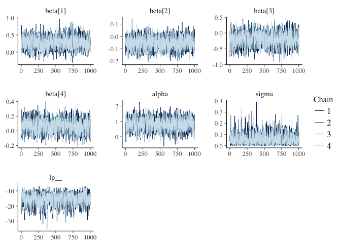
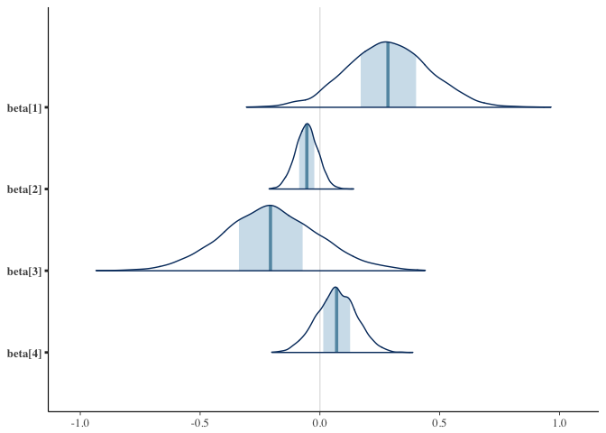
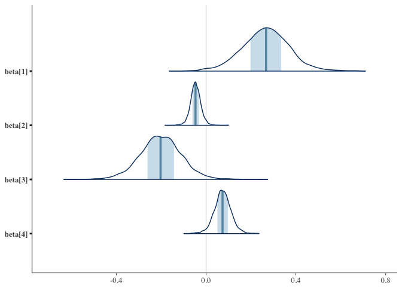
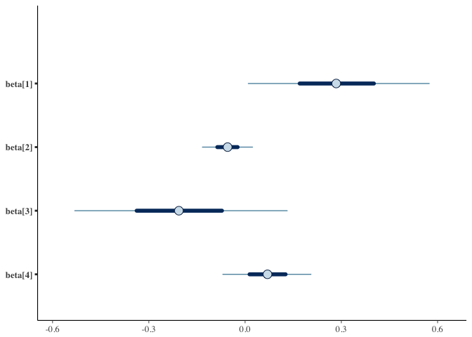
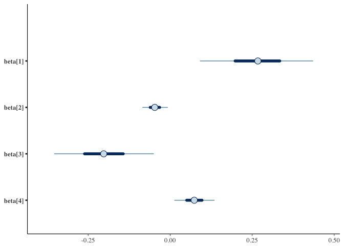

Stan models
================
2016-12-09

``` r
library(dplyr)
library(ggplot2)
```

Data
====

This loads a file containing posterior distributions for six Trophic Niche Metrics (TNM): dNr, dCr, TA, CD, MNND, and SDNND, from 16 different reef sites. Data file also contains three reef variables: LFTADen (Lionfish density /100m2), HASAve (averaged score of habitat complexity), and lionfish removal treatment (binary, yes/no).

``` r
d <- read.csv("data/FullCommNoLF.csv")
```

Quick model
===========

``` r
d_logged <- group_by(d, Site) %>%
  mutate_each(funs(log), dNr:SDNND)

d_means <- d_logged %>%
  summarise_each(funs(mean))

d_sds <- d_logged %>%
  summarise_each(funs(sd), dNr:SDNND) %>%
  dplyr::select(-Site)
names(d_sds) <- paste0(names(d_sds), "_sd")

d_sum <- data.frame(d_means, d_sds)
m1 <- lm(dNr ~ HASAve + LFTADen * RemovTreat, data = d_sum)
arm::display(m1)
#> lm(formula = dNr ~ HASAve + LFTADen * RemovTreat, data = d_sum)
#>                    coef.est coef.se
#> (Intercept)         0.81     0.20  
#> HASAve              0.26     0.09  
#> LFTADen            -0.05     0.02  
#> RemovTreat         -0.21     0.08  
#> LFTADen:RemovTreat  0.08     0.03  
#> ---
#> n = 16, k = 5
#> residual sd = 0.09, R-Squared = 0.60
```

Stan
====

Same model to check:

``` r
# d_sum <- d_sum %>% mutate() # standardize?
X <- model.matrix(dNr ~ 0 + HASAve + LFTADen * RemovTreat, data = d_sum)
stan_dat <- list(y_meas = d_sum$dNr, tau = d_sum$dNr_sd, N = nrow(d_sum), K = ncol(X), X = X)
```

``` r
library(rstan)
#> Loading required package: StanHeaders
#> rstan (Version 2.12.1, packaged: 2016-09-11 13:07:50 UTC, GitRev: 85f7a56811da)
#> For execution on a local, multicore CPU with excess RAM we recommend calling
#> rstan_options(auto_write = TRUE)
#> options(mc.cores = parallel::detectCores())
rstan_options(auto_write = TRUE)
options(mc.cores = parallel::detectCores())
```

``` r
writeLines(readLines("tmm.stan"))
#> data {
#>   int N;               // number of observations
#>   int K;               // number of predictors
#>   real y_meas[N];      // measurement of y
#>   matrix[N, K] X;      // model predictor matrix
#>   }
#> parameters {
#>   vector[K] beta;      // vector of predictors
#>   real alpha;          // intercept
#>   real<lower=0> sigma; // residual sd
#>   } 
#> model { 
#>   sigma ~ student_t(5, 0, 2);  // prior
#>   alpha ~ student_t(5, 0, 5);  // prior
#>   beta ~ student_t(5, 0, 2);   // prior
#>   y_meas ~ normal(alpha + X * beta, sigma); // likelihood
#> }
ctl <- list(adapt_delta = 0.95)
```

``` r
m_basic <- stan("tmm.stan", data = stan_dat, control = ctl)
m_basic
```

Measurement error model:

``` r
writeLines(readLines("tmm-meas.stan"))
#> data {
#>   int N;               // number of observations
#>   int K;               // number of predictors
#>   real y_meas[N];      // measurement of y
#>   real<lower=0> tau[N];   // measurement sd on y
#>   matrix[N, K] X;      // model predictor matrix
#>   }
#> parameters {
#>   vector[K] beta;      // vector of predictors
#>   real alpha;          // intercept
#>   real<lower=0> sigma; // residual sd
#>   real y_raw[N];
#> }
#> transformed parameters {
#>   real y[N];           // unknown true y value
#>   for (i in 1:N) {
#>     y[i] = alpha + X[i, ] * beta + sigma * y_raw[i];
#>   }
#> } 
#> model { 
#>   sigma ~ student_t(5, 0, 2);  // prior
#>   alpha ~ student_t(5, 0, 5);  // prior
#>   beta ~ student_t(5, 0, 2);   // prior
#>   y_meas ~ normal(y, tau);     // measurement model
#>   y_raw ~ normal(0, 1); // non-centered
#> }
```

``` r
m_meas <- stan("tmm-meas.stan", data = stan_dat, 
  pars = c("y", "y_raw"), include = FALSE, control = ctl)
m_meas
```

``` r
library(bayesplot)
#> This is bayesplot version 1.0.0
posterior <- extract(m_meas, inc_warmup = FALSE, permuted = FALSE)
mcmc_trace(posterior)
```



``` r
names(as.data.frame(X))
#> [1] "HASAve"             "LFTADen"            "RemovTreat"        
#> [4] "LFTADen:RemovTreat"

mcmc_areas(as.matrix(m_meas), regex_pars = "beta")
```



``` r
mcmc_areas(as.matrix(m_basic), regex_pars = "beta")
```



``` r

mcmc_intervals(as.matrix(m_meas), regex_pars = "beta")
```



``` r
mcmc_intervals(as.matrix(m_basic), regex_pars = "beta")
```



``` r
library(broom)
b_basic <- tidyMCMC(m_basic, estimate.method = "median", conf.int = TRUE)
b_meas <- tidyMCMC(m_meas, estimate.method = "median", conf.int = TRUE)
```

Other responses...
