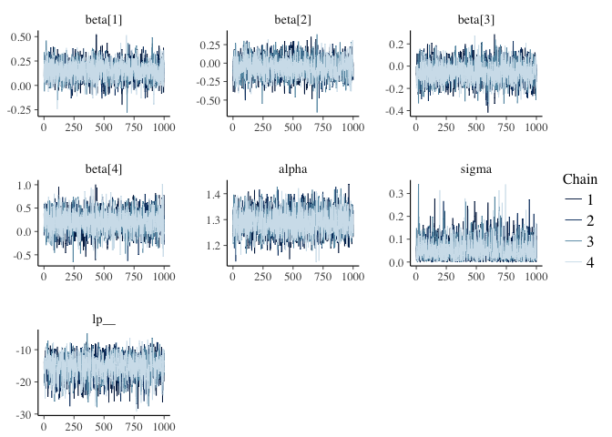
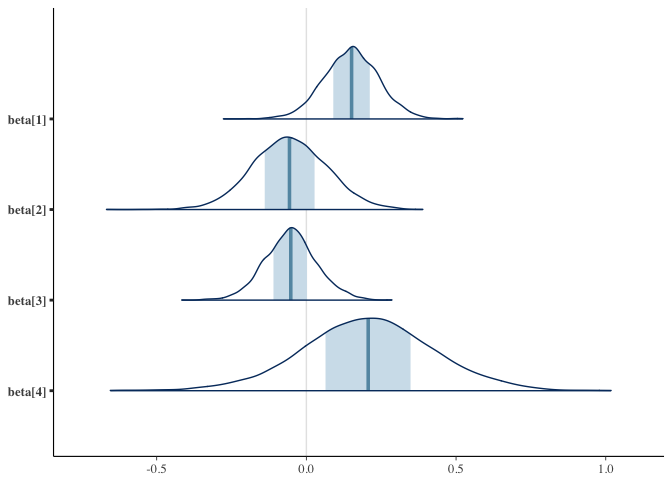
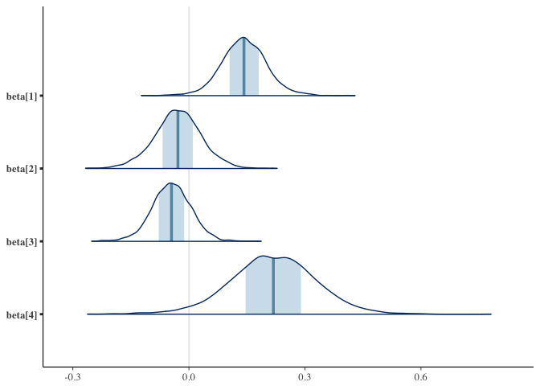
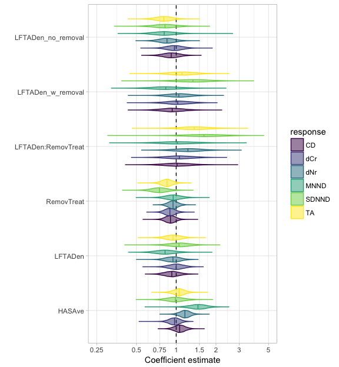

TNM Stan models
================
2016-12-10

``` r
library(dplyr)
library(ggplot2)
library(rstan)
rstan_options(auto_write = TRUE)
options(mc.cores = parallel::detectCores())
ctl <- list(adapt_delta = 0.99) # more robust than the default 
library(bayesplot)
# devtools::install_github("seananderson/stanhelpers") # if needed
library(stanhelpers)
```

Data
====

This loads a file containing posterior distributions for six Trophic Niche Metrics (TNM): dNr, dCr, TA, CD, MNND, and SDNND, from 16 different reef sites. Data file also contains three reef variables: LFTADen (Lionfish density /100m2), HASAve (averaged score of habitat complexity), and lionfish removal treatment (binary, yes/no).

``` r
d <- read.csv("data/FullCommNoLF.csv")
```

Quick model
===========

``` r
d_logged <- group_by(d, Site) %>%
  mutate_each(funs(log), dNr:SDNND)

d_means <- d_logged %>%
  summarise_each(funs(mean))

d_sds <- d_logged %>%
  summarise_each(funs(sd), dNr:SDNND) %>%
  dplyr::select(-Site)
names(d_sds) <- paste0(names(d_sds), "_sd")

d_sum <- data.frame(d_means, d_sds)

d_sum <- d_sum %>% mutate(HASAve = arm::rescale(HASAve), 
  LFTADen = arm::rescale(LFTADen),
  RemovTreat = arm::rescale(RemovTreat))

m1 <- lm(dNr ~ HASAve + LFTADen * RemovTreat, data = d_sum)
arm::display(m1)
#> lm(formula = dNr ~ HASAve + LFTADen * RemovTreat, data = d_sum)
#>                    coef.est coef.se
#> (Intercept)         1.27     0.02  
#> HASAve              0.14     0.05  
#> LFTADen            -0.03     0.05  
#> RemovTreat         -0.04     0.04  
#> LFTADen:RemovTreat  0.22     0.10  
#> ---
#> n = 16, k = 5
#> residual sd = 0.09, R-Squared = 0.60
```

brms
====

``` r
# # similar, but slightly different models:
# library(brms)
# m2 <- brm(dNr ~ 1 + HASAve + LFTADen * RemovTreat, data = d_sum)

# m3 <- brm(dNr | se(dNr_sd) ~ 1 + HASAve + LFTADen * RemovTreat, data = d_sum,
#   prior = c(prior(student_t(5, 0, 2), class = "b"), prior(student_t(5, 0, 5), class = "Intercept")))

# m4 <- brm(dNr | se(dNr_sd) ~ 1 + HASAve + LFTADen * RemovTreat + (1|Site), data = d_sum,
#   control = list(adapt_delta = 0.99),
#   prior = c(prior(student_t(5, 0, 2), class = "b"),
#     prior(student_t(5, 0, 5), class = "Intercept"),
#     prior(student_t(5, 0, 2), class = "sd")))
```

Stan
====

Same model to check:

``` r
X <- model.matrix(dNr ~ 0 + HASAve + LFTADen * RemovTreat, data = d_sum)
stan_dat <- list(y_meas = d_sum$dNr, tau = d_sum$dNr_sd, N = nrow(d_sum), K = ncol(X), X = X)
```

``` r
writeLines(readLines("tnm.stan"))
#> data {
#>   int N;               // number of observations
#>   int K;               // number of predictors
#>   real y_meas[N];      // measurement of y
#>   matrix[N, K] X;      // model predictor matrix
#> }
#> parameters {
#>   vector[K] beta;      // vector of predictors
#>   real alpha;          // intercept
#>   real<lower=0> sigma; // residual sd
#> } 
#> model { 
#>   sigma ~ student_t(3, 0, 1);  // prior
#>   alpha ~ student_t(3, 0, 10);  // prior
#>   beta ~ student_t(3, 0, 1);   // prior
#>   y_meas ~ normal(alpha + X * beta, sigma); // likelihood
#> }
```

``` r
m_basic <- stan("tnm.stan", data = stan_dat, control = ctl)
```

``` r
m_basic
#> Inference for Stan model: tnm.
#> 4 chains, each with iter=2000; warmup=1000; thin=1; 
#> post-warmup draws per chain=1000, total post-warmup draws=4000.
#> 
#>          mean se_mean   sd  2.5%   25%   50%   75% 97.5% n_eff Rhat
#> beta[1]  0.14    0.00 0.06  0.03  0.11  0.14  0.18  0.26  2686    1
#> beta[2] -0.03    0.00 0.06 -0.16 -0.07 -0.03  0.01  0.09  2425    1
#> beta[3] -0.04    0.00 0.05 -0.15 -0.08 -0.05 -0.01  0.06  3044    1
#> beta[4]  0.22    0.00 0.11 -0.01  0.15  0.22  0.29  0.43  3073    1
#> alpha    1.27    0.00 0.03  1.22  1.26  1.27  1.29  1.33  2948    1
#> sigma    0.10    0.00 0.02  0.07  0.08  0.10  0.11  0.16  1757    1
#> lp__    27.49    0.07 2.21 22.05 26.30 27.93 29.15 30.49  1130    1
#> 
#> Samples were drawn using NUTS(diag_e) at Sat Dec 10 10:22:12 2016.
#> For each parameter, n_eff is a crude measure of effective sample size,
#> and Rhat is the potential scale reduction factor on split chains (at 
#> convergence, Rhat=1).
```

That looks the same to me.

Measurement error model
=======================

Now let's use the following model that allows for measurement error on y:

``` r
writeLines(readLines("tnm-meas.stan"))
#> data {
#>   int N;               // number of observations
#>   int K;               // number of predictors
#>   real y_meas[N];      // measurement of y
#>   real<lower=0> tau[N];   // measurement sd on y
#>   matrix[N, K] X;      // model predictor matrix
#> }
#> parameters {
#>   vector[K] beta;      // vector of predictors
#>   real alpha;          // intercept
#>   real<lower=0> sigma; // residual sd
#>   real y_raw[N];
#> }
#> transformed parameters {
#>   real y[N];           // unknown true y value
#>   for (i in 1:N) {
#>     y[i] = alpha + X[i, ] * beta + sigma * y_raw[i]; // non-centered parameterization 'trick'
#>   }
#> } 
#> model { 
#>   sigma ~ student_t(3, 0, 1);  // prior
#>   alpha ~ student_t(3, 0, 10);  // prior
#>   beta ~ student_t(3, 0, 1);   // prior
#>   y_meas ~ normal(y, tau);     // measurement model
#>   y_raw ~ normal(0, 1);        // non-centered parameterization 'trick'
#> }
```

``` r
m_meas <- stan("tnm-meas.stan", data = stan_dat, 
  pars = c("y", "y_raw"), include = FALSE, control = ctl)
```

``` r
m_meas
#> Inference for Stan model: tnm-meas.
#> 4 chains, each with iter=2000; warmup=1000; thin=1; 
#> post-warmup draws per chain=1000, total post-warmup draws=4000.
#> 
#>           mean se_mean   sd   2.5%    25%    50%    75% 97.5% n_eff Rhat
#> beta[1]   0.15    0.00 0.09  -0.03   0.09   0.15   0.21  0.33  2782    1
#> beta[2]  -0.06    0.00 0.12  -0.30  -0.14  -0.06   0.03  0.19  2777    1
#> beta[3]  -0.05    0.00 0.09  -0.22  -0.11  -0.05   0.00  0.13  3015    1
#> beta[4]   0.20    0.00 0.22  -0.23   0.06   0.21   0.35  0.64  3805    1
#> alpha     1.29    0.00 0.04   1.21   1.26   1.29   1.32  1.38  3573    1
#> sigma     0.05    0.00 0.04   0.00   0.02   0.04   0.07  0.16  1920    1
#> lp__    -15.27    0.08 3.44 -22.85 -17.49 -14.92 -12.80 -9.39  1690    1
#> 
#> Samples were drawn using NUTS(diag_e) at Sat Dec 10 10:22:46 2016.
#> For each parameter, n_eff is a crude measure of effective sample size,
#> and Rhat is the potential scale reduction factor on split chains (at 
#> convergence, Rhat=1).
```

We can inspect and plot the output:

``` r
posterior <- extract(m_meas, inc_warmup = FALSE, permuted = FALSE)
mcmc_trace(posterior)
```



``` r
names(as.data.frame(X))
#> [1] "HASAve"             "LFTADen"            "RemovTreat"        
#> [4] "LFTADen:RemovTreat"

mcmc_areas(as.matrix(m_meas), regex_pars = "beta")
```



``` r
mcmc_areas(as.matrix(m_basic), regex_pars = "beta")
```



So the posteriors are definitely wider in the case when we allow for the measurement error.

Other responses
===============

Now that the above models are working, let's apply them to the various responses.

The following function will format the data and fit the model for a given response. It also has the option of centering or not centering the removal variable.

``` r
fit_tnm <- function(response, center_removal = FALSE) {
  d_sum <- data.frame(d_means, d_sds)
  d_sum <- d_sum %>% mutate(
    HASAve = arm::rescale(HASAve), 
    LFTADen = arm::rescale(LFTADen))
  if (center_removal) d_sum$RemovTreat - mean(d_sum$RemovTreat)
  
  f <- paste(response, "~ 0 + HASAve + LFTADen * RemovTreat")
  X <- model.matrix(as.formula(f), data = d_sum)
  stan_dat <- list(y_meas = d_sum[, response], tau = d_sum$dNr_sd, N = nrow(d_sum), 
    K = ncol(X), X = X)
  m <- stan("tnm-meas.stan", data = stan_dat,
    pars = c("y", "y_raw"), include = FALSE, control = list(adapt_delta = 0.99), 
    iter = 4000, chains = 4)
  m
}
```

Now let's apply the function to each of the responses.

``` r
responses <- names(d)[2:6]
# out <- lapply(responses, fit_tnm, center_removal = FALSE)
# names(out) <- responses
out_cent <- lapply(responses, fit_tnm, center_removal = TRUE)
names(out_cent) <- responses
```

Here we will extract the posteriors from the models and reformat the output for plotting. Also, we will calculate the effect of lionfish density for the case without removals (-0.5) and for the case with removals (0.5).

``` r
stopifnot(identical(mean(d$RemovTreat), 0.5)) # Just in case! 
p <- plyr::ldply(out_cent, stanhelpers::extract_df, output = "wide_df")
names(p)[2:5] <- names(as.data.frame(X))
p <- mutate(p, LFTADen_w_removal = LFTADen + 0.5 * `LFTADen:RemovTreat`,
  LFTADen_no_removal = LFTADen - 0.5 * `LFTADen:RemovTreat`)
p <- select(p, -alpha, -sigma, -`lp__`) %>% # cleaning up 
  rename(Response = `.id`)
p <- reshape2::melt(p) # make a long format for ggplot
```

``` r
labs <- c(0.25, 0.5, 0.75, 1, 1.5, 2, 3)
ggplot(p, aes(variable, value, fill = Response, colour = Response)) + 
  geom_hline(yintercept = 0, lty = 2) + xlab("") +
  scale_y_continuous(breaks = log(labs), labels = labs) +
  geom_violin(position = position_dodge(width = 0.8), alpha = 0.5) +
  coord_flip() +
  viridis::scale_fill_viridis(discrete = TRUE) +
  viridis::scale_color_viridis(discrete = TRUE) +
  theme_light() +
  ylab("Coefficient estimate")
```



``` r
ggsave("figs/tnm-estimates.pdf", width = 6.5, height = 6.5)
```

In the above plot, I labeled the x axis with the exponentiated versions of the coefficients. These are the multiplicative effects. So, for example, a value of 0.6 means that the response will be 60% of what it was if the predictor increases by 2 standard deviations (or in the case of the treatment, the lionfish are removed).

We can calculate the probability a given coefficient is above or less than 0 (i.e. the multiplicative effect is above or below 1) (because this is a Bayesian model). You can use these values when you report results. We can also calculate lots of other things depending on what would be meaningful (e.g. credible intervals on the effects).

``` r
sum_table <- p %>% group_by(variable, Response) %>% 
  summarize(
    prob_less_0 = round(sum(value < 0)/n(), 2),
    prob_above_0 = round(sum(value > 0)/n(), 2))
knitr::kable(sum_table)
```

| variable             | Response |  prob\_less\_0|  prob\_above\_0|
|:---------------------|:---------|--------------:|---------------:|
| HASAve               | CD       |           0.25|            0.75|
| HASAve               | dCr      |           0.63|            0.37|
| HASAve               | dNr      |           0.05|            0.95|
| HASAve               | MNND     |           0.01|            0.99|
| HASAve               | TA       |           0.32|            0.68|
| LFTADen              | CD       |           0.72|            0.28|
| LFTADen              | dCr      |           0.59|            0.41|
| LFTADen              | dNr      |           0.88|            0.12|
| LFTADen              | MNND     |           0.87|            0.13|
| LFTADen              | TA       |           0.93|            0.07|
| RemovTreat           | CD       |           0.87|            0.13|
| RemovTreat           | dCr      |           0.88|            0.12|
| RemovTreat           | dNr      |           0.74|            0.26|
| RemovTreat           | MNND     |           0.66|            0.34|
| RemovTreat           | TA       |           0.94|            0.06|
| LFTADen:RemovTreat   | CD       |           0.48|            0.52|
| LFTADen:RemovTreat   | dCr      |           0.40|            0.60|
| LFTADen:RemovTreat   | dNr      |           0.18|            0.82|
| LFTADen:RemovTreat   | MNND     |           0.48|            0.52|
| LFTADen:RemovTreat   | TA       |           0.09|            0.91|
| LFTADen\_w\_removal  | CD       |           0.72|            0.28|
| LFTADen\_w\_removal  | dCr      |           0.50|            0.50|
| LFTADen\_w\_removal  | dNr      |           0.66|            0.34|
| LFTADen\_w\_removal  | MNND     |           0.87|            0.13|
| LFTADen\_w\_removal  | TA       |           0.65|            0.35|
| LFTADen\_no\_removal | CD       |           0.66|            0.34|
| LFTADen\_no\_removal | dCr      |           0.61|            0.39|
| LFTADen\_no\_removal | dNr      |           0.89|            0.11|
| LFTADen\_no\_removal | MNND     |           0.77|            0.23|
| LFTADen\_no\_removal | TA       |           0.95|            0.05|

Here's what I see: *(numbers might have changed slightly)*

-   None of these effects are overly strong
-   There's a reasonably high probability that most of the responses are lower in the case of lionfish removals (for a site with average lionfish density) (see the `RemovTreat` effect). For example, there is about a 95% probability this is true for `TA` and about a 88% probability this is true for `CD` and `dCr`.
-   There is a fairly high probability (ranging from 0.6 to 0.95) that some of these responses (TA, dCr, dNr) are negatively related with lionfish density (`LFTADen`). This is for an average site, or in other words across all sites including those with and without removals.
-   The effect of lionfish density looks a bit stronger (negative) in the case of no removals `LFTADen_no_removal`, BUT the interaction between lionfish density and treatment is very weak (or at least very uncertain) (see `LFTADen:RemovTreat`).
-   There is weak evidence for an effect of the habitat variable on the responses with the exception of positive relationship between the habitat variables and `dNr` and `MMND`, with ~0.98 or 0.99 probability for the latter. (`HASAve`)
